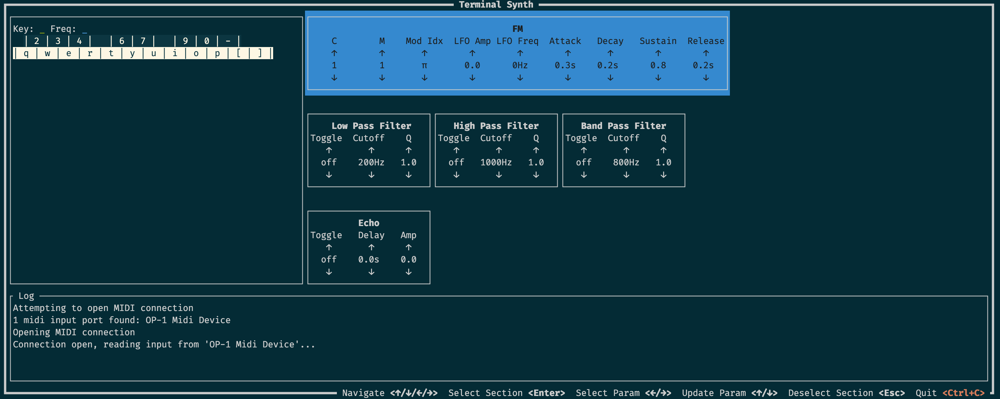
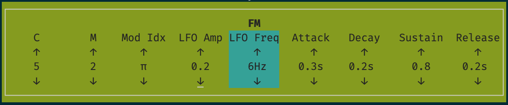

# Terminal Synth

Basic frequency modulation synthesizer written in Rust, with a terminal UI.

At this time, this is not intended to be a highly usable instrument, rather a playground for learning audio programming/digital signal processing.

Eventually, it may become a more practical instrument or evolve into a hardware project.

### Running

At this time, MIDI may be used for note events, but not control change events (i.e. you can use MIDI to play, but not yet to change parameters). If you have a MIDI controller, plug it in prior to startup, and it should be automatically found.

Requires [Rust & Cargo](https://doc.rust-lang.org/cargo/getting-started/installation.html)

```bash
cargo build # optional
cargo run
```

This will open the FM Synth application in your terminal. The instrument has 5 voices (i.e. 5 notes may be played at once).



On the left, there is a map of (computer) keyboard keys laid out like an instrument keyboard, where "e" is A440, "4" is B-flat, "3" is A-flat, etc. This can be used to play around with a small range of notes if you don't have a MIDI controller.

On the right are the instrument and effect parameter controls:

- arrow keys navigate to the desired section
- enter selects a section; escape de-selects
- within a section:
  - left/right arrow keys select parameters
  - up/down arrow keys change parameters


